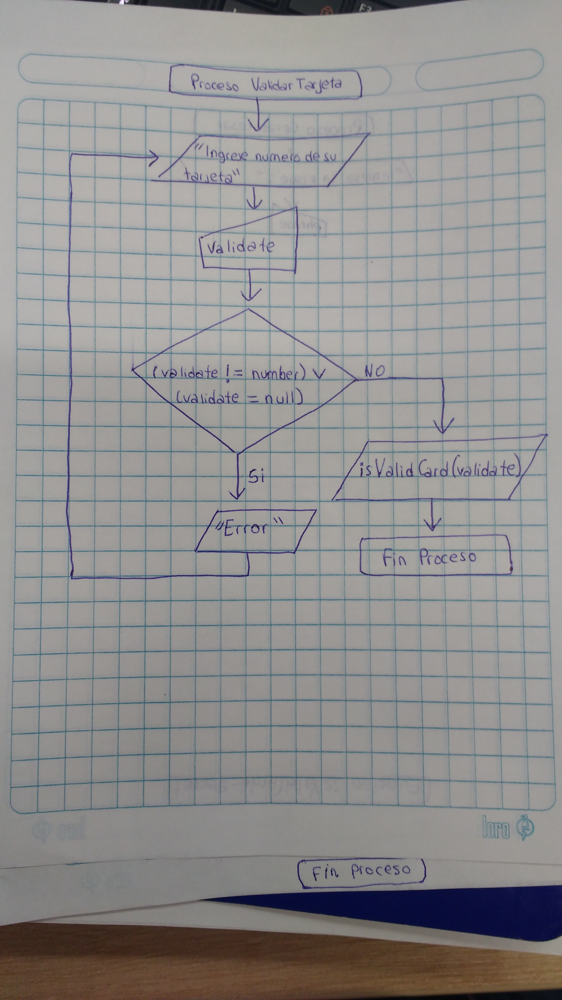
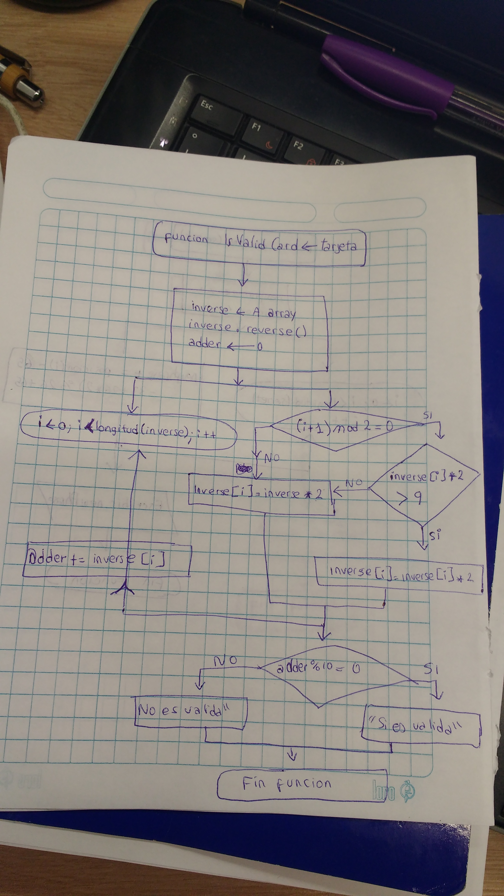

# Validacion del numero de tarjeta de credito o debito

## Introduction

La validacion del número de tarjeta esta construido en base al algoritmo de Luhn. El algoritmo de Luhn o fórmula de Luhn, también conocida como "algoritmo de módulo 10", es una fórmula de suma de verificación, utilizada para validar una diversidad de números de identificación; como números de tarjetas de crédito, números IMEI, etc.

## Diagramas de Flujo

> Para la solución del programa se presenta el diagrama de flujo.

 * En la imagen el diagrama de flujo corresponde al ingreso y validación de datos ingresados, una vez ingresados se invoca a la función inValidCard que se muestra en la siguiente imagen.

## Pseudocodigo

      funcion isValidCard(tarjeta){
        declarar inverse
        convertir inverse a arrar
        inverse.reverse()
        declarar adder <- 0

        para(i<-0; i < longitud(inverse); i++){
             si((i+1) mod 2 === 0){
               si(inverse[i] * 2 > 9)
                    inverse[i] = inverse[i] * 2
               si no
                    inverse[i] = inverse * 2

             }
          adder += inverse[i]
        }

        si(adder mod 10 === 0)
            Escribir Es valida
        si no
            Escribir No es valida

      }

      Escribir Ingrese numero de tarjeta
      Leer validate
      si(validate != numero || validate = null)
          Escribir [Error]
      si no
          isValidCard(validate)
